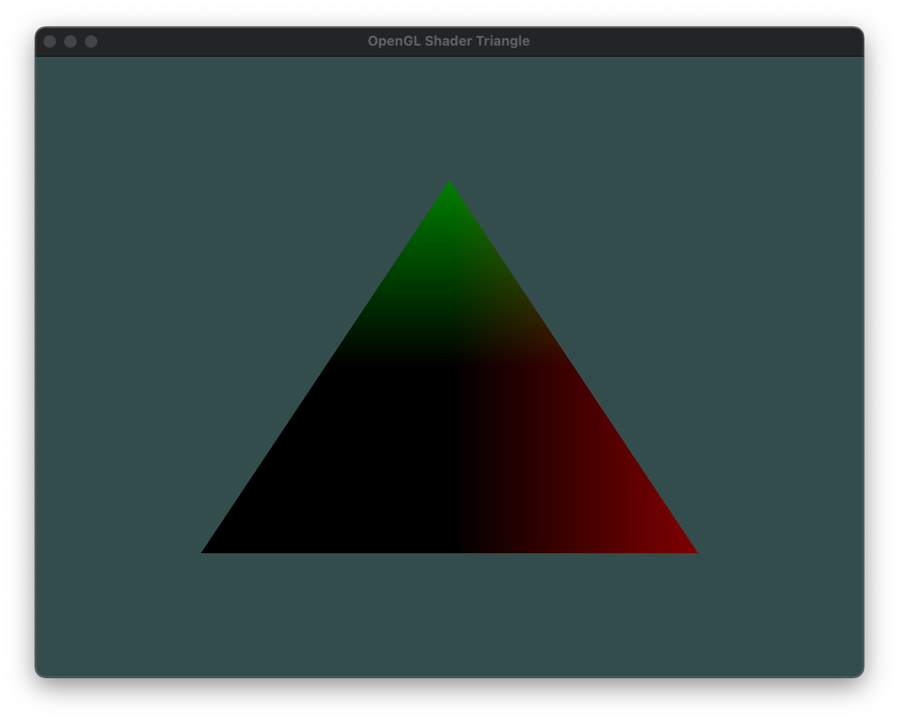
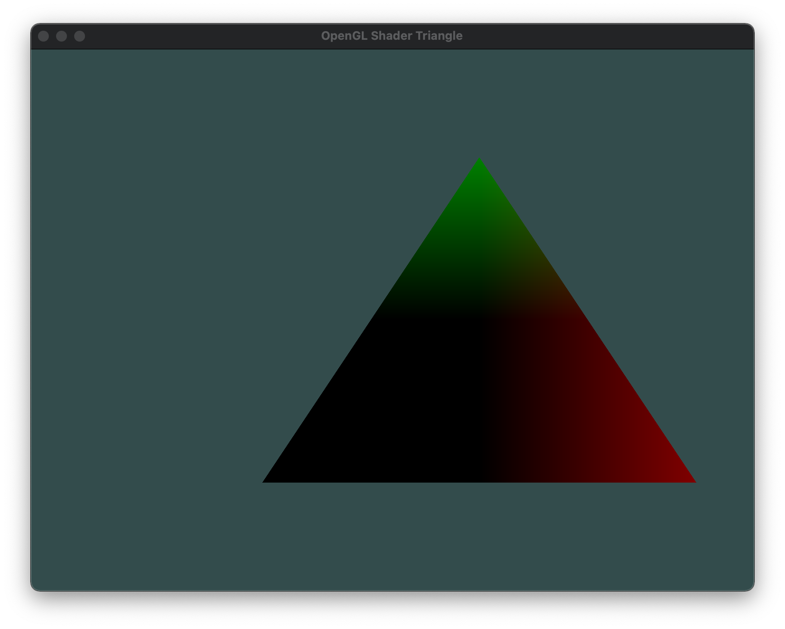

### Wrap shader code inside class

### Vertex Shader and Fragment Shader
``` cpp
std::string vertexShaderStr = R"(
#version 330 core
    layout (location = 0) in vec3 aPos;
    layout (location = 1) in vec3 aColor;
    uniform mat4 mymat;
    out vec3 ourColor;
    void main()
    {
        mat4 tmat;
        tmat = mat4(1.2, 0.0, 0.0, 0.0,
                    0.0, 1.2, 0.0, 0.0,
                    0.0, 0.0, 1.2, 0.0,
                    0.0, 0.0, 0.0, 1.0);

        gl_Position = tmat*mymat * vec4(aPos, 1.0);
        ourColor = aPos;

        // gl_Position = tmat * vec4(aPos, 1.0);
    }
)";


std::string fragStr = R"(
#version 330 core
    out vec4 FragColor;
    in  vec3 ourColor;
    // uniform vec4 ourColor;
    void main()
    {
       FragColor = vec4(ourColor, 1.0f);
    }
)";

```

### what are the *layout* and *location* in shader

``` cpp

    float trixx[] = {
        0.5f, -0.5f, 0.0f,   1.0f, 0.0f, 0.0f,
        -0.5f, -0.5f, 0.0f,  0.0f, 1.0f, 0.0f,
        0.0f,  0.5f, 0.0f,   0.0f, 0.0f, 1.0f
                           //  R     G     B
    };

    layout (location = 0) in vec3 aPos;
                       ↑
                       |
                       |
                       ↓
 glVertexAttribPointer(0, 3, GL_FLOAT, GL_FALSE, 6*sizeof(float), (void*)0);

    layout (location = 1) in vec3 aColor;
                       ↑
                       |
                       |
                       ↓
 glVertexAttribPointer(1, 3, GL_FLOAT, GL_FALSE, 6*sizeof(float), (void*)(3*sizeof(float)));
```

### Access matrix in shader from OpenGL
Get matrix id from *shader* or How to access the matrix variable from OpenGL
``` cpp
	GLuint matrixId = glGetUniformLocation(shaderProgram, "mymat");
```
Pass new matrix to *shader*

``` cpp
    float mat[] = { 1.0, 0.0, 0.0, 0.0,
                    0.0, 1.0, 0.0, 0.0,
                    0.0, 0.0, 1.0, 0.0,
                    0.0, 0.0, 0.0, 1.0    // <- translation vector
                };

    glUseProgram(shaderHandle);
    glUniformMatrix4fv(matrixId, 1, GL_FALSE, mat);
```



### Translate triangle along x-axis to 0.2
``` cpp
    float mat[] = { 1.0, 0.0, 0.0, 0.0,
                    0.0, 1.0, 0.0, 0.0,
                    0.0, 0.0, 1.0, 0.0,
                    0.2, 0.0, 0.0, 1.0   // <- translation vector
                };

    glUseProgram(shaderHandle);
    glUniformMatrix4fv(matrixId, 1, GL_FALSE, mat);
```

